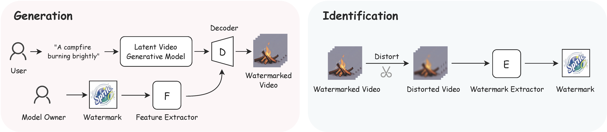
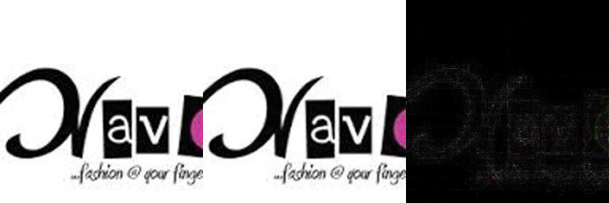
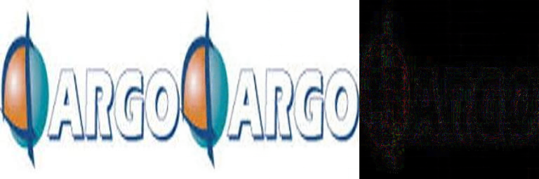
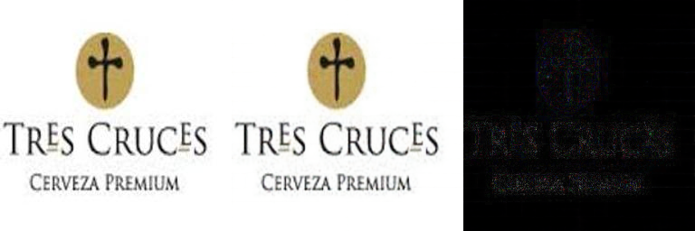
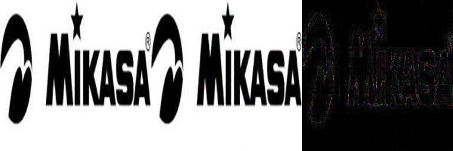

<p align="center">
  <h2 align="center"><strong>Safe-Sora: Safe Text-to-Video Generation<br> via Graphical Watermarking</strong></h2>

<p align="center">
  <a href="https://github.com/Sugewud">Zihan Su<sup>1</sup></a>,
  <a href="https://scholar.google.com/citations?user=bMwW4e8AAAAJ&hl=zh-CN">Xuerui Qiu<sup>2</sup></a>,
  <a href="https://scholar.google.com/citations?hl=zh-CN&user=mRC_emoAAAAJ">Hongbin Xu<sup>3</sup></a>,
  <a href="https://dblp.org/pid/369/7675.html">Tangyu Jiang<sup>1</sup></a>,
  <a href="https://scholar.google.co.in/citations?user=J3olRccAAAAJ&hl=en">Junhao Zhuang<sup>1</sup></a>,<br>
  <a href="https://scholar.google.com/citations?hl=en&user=fYdxi2sAAAAJ">Chun Yuan<sup>1†</sup></a>,
  <a href="https://scholar.google.com/citations?user=2wySPkcAAAAJ&hl=zh-CN">Ming Li<sup>4†</sup></a>,
  <a href="https://scholar.google.com/citations?user=rBWnK8wAAAAJ&hl=en">Shengfeng He<sup>5</sup></a>,
  <a href="https://dblp.org/pid/16/6654.html">Fei Richard Yu<sup>4</sup></a>
</p>

<p align="center">
  <sup>1</sup> Tsinghua University 
  <sup>2</sup> Institute of Automation, Chinese Academy of Sciences <br>
  <sup>3</sup> South China University of Technology<br>
  <sup>4</sup> Guangdong Laboratory of Artificial Intelligence and Digital Economy (SZ) <br>
  <sup>5</sup> Singapore Management University<br>
  <sup>†</sup>Corresponding Author
</p>

<div align="center">

<div style="text-align: center;">
  <a href='https://sugewud.github.io/Safe-Sora-project/'></a> &nbsp;
  <a href='https://arxiv.org/abs/2505.12667'></a>
</div>

</div>

## Release
- [09/19] 🚀 🚀  Code Released! 
- [09/18] 🎉 🎉 Safa-Sora is accepted by NeurIPS 2025! 
- [05/23] Initial Preview Release 🔥 Coming Soon!

## 🔆 Introduction
Safe-Sora is the first framework that integrates graphical watermarks directly into the video generation process.
<br><br> 

<br><br> 
The following results show the original video, the watermarked video, the difference between them (×5), the original watermark, the recovered watermark, and the difference between them (×5).

<table>
  <tr>
    <td></td>
    <td></td>
  </tr>
  <tr>
    <td></td>
    <td></td>
  </tr>
  <tr>
    <td></td>
    <td></td>
  </tr>
  <tr>
    <td></td>
    <td></td>
  </tr>
</table>

## 📋 File Preparation

Download the files and place them in the root directory.

- [checkpoints](https://drive.google.com/file/d/1ciKIafSQFbulL3xvQjARYPxxnvnpXGaI/view?usp=sharing) contains the pretrained weights for Safe-Sora, VideoCrafter2, the VAE, and the 3D-CNN (simulating H.264 compression).
- [dataset](https://drive.google.com/file/d/1-aIaPyhkufrwWMVva_bAZ2I4kh-_OMII/view?usp=sharing) contains the Logo-2K dataset and the Panda-70M dataset.
- [mamba](https://drive.google.com/file/d/1fnm67gq_0xfTWpTG08ByKXlK4wfG39Qz/view?usp=sharing) is provided for setting up the environment.
- [causal-conv1d](https://drive.google.com/file/d/1RIR4i9MyCfgnmeXrjhQOBR0bkIV-VDFT/view?usp=sharing) is provided for setting up the environment.

## 💻 Requirements

To install requirements:

```setup
conda create -n safe-sora python=3.9
conda activate safe-sora
conda install pytorch==2.1.1 torchvision==0.16.1 torchaudio==2.1.1 pytorch-cuda=11.8 -c pytorch -c nvidia

pip install packaging ninja==1.11.1.1
cd causal-conv1d
python setup.py install
cd ../mamba
python setup.py install

cd ..
pip install -r requirements.txt
```

## 🐶 Training
To train Safe-Sora, run this command:

```train
bash train.sh 
```

We use DDP to train Safe-Sora. You can modify the parameters in train.sh to select which GPUs to use.

## 🚀 Evaluation

To evaluate our models, run:

```eval
bash test.sh 
```

## 🙌🏻 Acknowledgement
Our code is based on these awesome repos:
* [Mamba](https://github.com/state-spaces/mamba)
* [RainMamba](https://github.com/TonyHongtaoWu/RainMamba)
* [FreqMamba](https://github.com/aSleepyTree/FreqMamba)


## 📖 BibTeX
If you find our repo helpful, please consider leaving a star or cite our paper :)
```bibtex
@misc{su2025safesorasafetexttovideogeneration,
  title={Safe-Sora: Safe Text-to-Video Generation via Graphical Watermarking}, 
  author={Zihan Su and Xuerui Qiu and Hongbin Xu and Tangyu Jiang and Junhao Zhuang and Chun Yuan and Ming Li 
          and Shengfeng He and Fei Richard Yu},
  year={2025},
  eprint={2505.12667},
  archivePrefix={arXiv},
  primaryClass={cs.CV},
  url={https://arxiv.org/abs/2505.12667}, 
}
```
