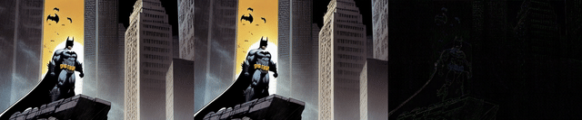

<p align="center">
  <h2 align="center"><strong>Safe-Sora: Safe Text-to-Video Generation<br> via Graphical Watermarking</strong></h2>

<p align="center">
  <a href="https://github.com/Sugewud">Zihan Su<sup>1</sup></a>,
  <a href="https://scholar.google.com/citations?user=bMwW4e8AAAAJ&hl=zh-CN">Xuerui Qiu<sup>2</sup></a>,
  <a href="https://scholar.google.com/citations?hl=zh-CN&user=mRC_emoAAAAJ">Hongbin Xu<sup>3</sup></a>,
  <a href="https://dblp.org/pid/369/7675.html">Tangyu Jiang<sup>1</sup></a>,
  <a href="https://scholar.google.co.in/citations?user=J3olRccAAAAJ&hl=en">Junhao Zhuang<sup>1</sup></a>,<br>
  <a href="https://scholar.google.com/citations?hl=en&user=fYdxi2sAAAAJ">Chun Yuan<sup>1†</sup></a>,
  <a href="https://scholar.google.com/citations?user=2wySPkcAAAAJ&hl=zh-CN">Ming Li<sup>4†</sup></a>,
  <a href="https://scholar.google.com/citations?user=rBWnK8wAAAAJ&hl=en">Shengfeng He<sup>5</sup></a>,
  <a href="https://dblp.org/pid/16/6654.html">Fei Richard Yu<sup>4</sup></a>
</p>

<p align="center">
  <sup>1</sup> Tsinghua University 
  <sup>2</sup> Institute of Automation, Chinese Academy of Sciences <br>
  <sup>3</sup> South China University of Technology<br>
  <sup>4</sup> Guangdong Laboratory of Artificial Intelligence and Digital Economy (SZ) <br>
  <sup>5</sup> Singapore Management University<br>
  <sup>†</sup>Corresponding Author
</p>

<div align="center">

<div style="text-align: center;">
  <a href='https://sugewud.github.io/Safe-Sora-project/'></a> &nbsp;
  <a href='https://arxiv.org/abs/2505.12667'></a>
</div>

</div>

## Release
- [05/23] Initial Preview Release 🔥 Coming Soon!

## Contents
- [Release](#release)
- [Contents](#contents)
- [🔆 Introduction](#-introduction)
- [📆 TODO](#-todo)
- [📖 BibTeX](#-bibtex)

## 🔆 Introduction
Safe-Sora is the first framework that integrates graphical watermarks directly into the video generation process.
<br><br> 

<br><br> 
The following results show the original video, the watermarked video, the difference between them (×5), the original watermark, the recovered watermark, and the difference between them (×5).

<table>
  <tr>
    <td></td>
    <td></td>
  </tr>
  <tr>
    <td></td>
    <td></td>
  </tr>
  <tr>
    <td></td>
    <td></td>
  </tr>
  <tr>
    <td></td>
    <td></td>
  </tr>
</table>


## 📆 TODO
The repo is still being under construction, thanks for your patience. 
- [ ] Release of code.

## 📖 BibTeX
If you find our repo helpful, please consider leaving a star or cite our paper :)
```bibtex
@misc{su2025safesorasafetexttovideogeneration,
  title={Safe-Sora: Safe Text-to-Video Generation via Graphical Watermarking}, 
  author={Zihan Su and Xuerui Qiu and Hongbin Xu and Tangyu Jiang and Junhao Zhuang and Chun Yuan and Ming Li 
          and Shengfeng He and Fei Richard Yu},
  year={2025},
  eprint={2505.12667},
  archivePrefix={arXiv},
  primaryClass={cs.CV},
  url={https://arxiv.org/abs/2505.12667}, 
}
```
